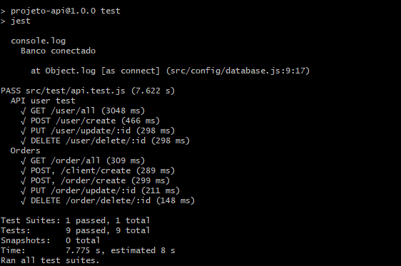

#   <div align="center">  **🧪Testando a Web API de Serviços com Jest/SuperTest** </div>

<div align = "center">
    <p>
        Turma Online Todas em Tech - Back-end | Semana 15: Introdução: Automações de <b>Testes</b>.
    </p>
</div>

<div align="center"> 

### Projeto da Semana 15 da {Reprograma}, para realizar automação de testes em CRUD na API. 
</div>

<br>
<div align="justify"> 

O projeto consiste em cadastrar `funcionários` (users) de estabelecimentos para que possam ter acesso aos registros de `pedidos` (orders) e `dados dos clientes` (clients).

</div>

## 📑 Arquitetura do Projeto

```
├──📁 ON15-TET-S13-PG-III
    ├──📁 class
    ├──📁 homework
    |    ├─📁 node_modules          
    │    ├─📁 src   
    |    |  ├─📁 config
    |    |  |  └─📄database.js                
    │    │  ├─📁controllers            
    │    │  │  └─📄authController.js  
    |    |  |  └─📄clientsController.js 
    |    |  |  └─📄ordersController.js 
    |    |  |  └─📄userController.js      
    │    │  ├─📁models                 
    │    │  │  └─📄clientSchema.js   
    |    |  |  └─📄ordersSchema.js    
    |    |  |  └─📄userSchema.js 
    │    │  ├─📁routes                 
    │    |  |  └─📄clientsRoutes.js    
    |    |  |  └─📄ordersRoutes.js  
    |    |  |  └─📄userRoutes.js
    |    |  ├─📁test                 
    │    |  |  └─📄api.test.js 
    |    |  └─📄app.js 
    |    ├─📄README.md
    |    ├─📄.env.example
    |    ├─📄 package-lock.json         
    |    ├─📄 package.json                 
    |    └─📄 server.js      
    ├─📄.gitignore
    └─📄README.md
         
    
```

## ⚙️ Dependências do Projeto
    - Mongoose
    - Cors
    - Express
    - Nodemon
    - Bcrypt
    - Dotenv-safe
    - Json web token
    - Jest
    - SuperTeste

## 💻 Dependências de ambiente
    - Node 
    - Mongodb 

## 📚 Collection

<div> 

A `collection` possui uma coleção onde armazenamos os pedidos e informações úteis dos clientes para os estabelecimentos.  

</div>

<p>

Exemplo de `Cliente` cadastrado:

</p>

```json
[
    {
        "_id": "62bf552d968417f4edc4b06c",
        "name": "Mario Lima",
        "socialName": "Mariana Lima",
        "address": "R. Frei Afonso Maria",
        "number": 200,
        "phone": "3333-5555",
        "referencePoint": "em frente ao hospital",
        "createdAt": "Fri Jul 01 2022 17:12:29 GMT-0300 (Horário Padrão de Brasília)"
    }
]
```

<p>

Exemplo de `Pedido` cadastrado:

</p>

```json
[
    {
    "client": [
        "62bf552d968417f4edc4b06c"
    ],
    "description": "1 caipirinha, 04 cervejas long neck, 1 porção de batata frita",
    "price": 70.00,
    "createdAt": "2022-07-05T18:18:30.875Z",
    "_id": "62c480764fd5f73ee34ef91e",
    
}
]
```

<p>

Exemplo de impressão de `Pedido e Cliente`:

</p>

```json
[
    {
        "_id": "62c480764fd5f73ee34ef91e",
        "client": [
            {
                "_id": "62bf552d968417f4edc4b06c",
                "name": "Mario Lima",
                "socialName": "Mariana Lima",
                "address": "R. Frei Maria",
                "number": 200,
                "phone": "3333-5555",
                "referencePoint": "em frente ao hospital",
                "createdAt": "Fri Jul 01 2022 17:12:29 GMT-0300 (Horário Padrão de Brasília)"
            }
        ],
        "description": "1 caipirinha, 04 cervejas long neck, 1 porção de batata frita",
        "price": 70.00,
        "createdAt": "2022-07-05T18:18:30.875Z"
    }
]
```

## `{}` Schema

<p> O Schema contém os itens a serem inseridos na criação de novos registros e seu grau de importância/obrigatoriedade. </p>

<p>

Schema do `Cliente`:

</p>


```javascript
const clientSchema = new mongoose.Schema({
    id: mongoose.Schema.Types.ObjectId,
    name: {
        type: String, 
        required: true,
        
    },
    socialName: {
        type: String            
    },
    address: {
        type: String,
        required: true
    },
    number: {
        type: Number,
        required: true
    },
    phone: {
        type: String,
        required: true,
        unique: true
    },
    referencePoint: {
        type: String
    },
    createdAt: {
        type: String,
        default: new Date()
    }
    }, { timestamps  : true })

```

<p>

Schema do `Pedido`:

</p>


```javascript
const orderSchema = new mongoose.Schema({
    _id: {
        type: mongoose.Types.ObjectId,
        default: mongoose.Types.ObjectId
    },
    client: [{ 
        type: mongoose.Schema.Types.ObjectId, 
        ref: 'client' 
    }],
    description: { 
        type: String, 
        required: true 
    },
    price: { 
        type: Number, 
        required: true, 
        float: true },
}, { timestamps  : true })

```

<p>

Schema do `Usuário`:

</p>


```javascript
const userSchema = new mongoose.Schema({
    id: mongoose.Schema.Types.ObjectId,
    name: {
        type: String,
        required: true
    },
    email: {
        type: String,
        required: true
    },
    password: {
        type: String,
        required: false
    },
    createdAt: {
        type: String,
        default: new Date()
    }
});

```

##  🛣️ ROTAS
<br>

###  Método GET

<div align = "center">

|  Método  |                  Rota                       |                     Descrição                                |
| :------: | :-------------------------------------:     | :-------------------------------------------------------:    |
|  `GET`   | localhost:8090/client/all                    |    Lista de todos os clientes                        |
|  `GET`   | localhost:8090/client/id/:id                 |             Busca por ID                                     |
|  `GET`   | localhost:8090/order/all                    |    Lista de todos os pedidos                        |
|  `GET`   | localhost:8090/order/id/:id                 |             Busca por ID                                     |


<br>
</div>

### Método POST

<div align = "center">

|  Método  |                  Rota                       |                     Descrição                                |
| :------: | :-------------------------------------:     | :-------------------------------------------------------:    |
|  `POST`  | localhost:8090/client/create                 |    Cria novos registros de clientes                  |
|  `POST`  | localhost:8090/order/create                 |    Cria novos registros de pedidos 
|  `POST`  | localhost:8090/user/create                 |    Cria novos registros de usuários                  |
<br>
</div>

###  Método PUT

<div align = "center">

|  Método  |                  Rota                       |                                Descrição                     |
| :------: | :-------------------------------------:     | :-------------------------------------------------------:    |
|   `PUT`  |  localhost:8090/client/update/:id        |       Atualizar os dados dos clientes por ID                  |
|  `PUT`  | localhost:8090/order/update/:id                 |    Atualizar os pedidos por ID                  |
|  `PUT`  | localhost:8090/user/update/:id                 |    Atualizar os usuário por ID                  |
|  `PUT`  | localhost:8090/user/updatePassword/:id                 |    Atualizar a senha do usuário por ID                  |

<br>
</div>

###  Método DELETE

<div align = "center">

|  Método  |                  Rota                       |                                Descrição                     |
| :------: | :-------------------------------------:     | :-------------------------------------------------------:    |
| `DELETE` |  localhost:8090/client/delete/:id        |                      Deletar registro de cliente por ID          |
| `DELETE` |  localhost:8090/order/delete/:id        |                      Deletar pedido por ID          |
| `DELETE` |  localhost:8090/user/delete/:id        |                      Deletar usuário por ID          |

<br>
</div>

## 🧪 <b> Tests Results</b>


<p> 

Para esta API realizei testes no CRUD do `DELETE` (user) e do `pedido` (order). Aqui estão os resultados: 




</p>

<div>
</div>

<br>

###  INSTALAÇÃO: 

1. Entre na pasta onde você deseja clonar o repositório. Abra o **git** nela e digite: 

    ```bash
    $ git clone https://github.com/elizapimentel/ON15-TET-S14-AUTH.git
     ```

2. Digite a linha abaixo para entrar na branch correta: 

   ```bash
    $ git checkout eliza
     ```

3. Digite a linha abaixo para entrar na pasta correta: 

    ```bash
    $ cd para-o-lar/
     ```
    
4. Escreva a seguinte linha para instalar as dependências utilizadas nesse projeto: 

   ```bash
    $ npm install
    ```
5. Inicie o servidor como comando: 

   ```bash
    $ npm run dev
    ```   
6. Realize a verificação dos testes da API com o comando:

    ```bash
    $ npm run test
    ```

<br>

<div align = "justify">

###  Teste na sua máquina 💻: 

- Importe a coleção para teste deste servidor clicando [aqui](https://www.getpostman.com/collections/d59ddc784f7e38a298bb) !

- Copie o link acima e, no [Postman](https://www.postman.com/downloads/), clique em *Import* -> *Link* (cole o link) -> *Continue* -> *Import*.

- Ou fork diretamente para o seu Postman através do link:<div align = "justify"> [](https://god.gw.postman.com/run-collection/20977005-8c4b0cfb-3001-4c68-a1ee-cd85d1402a2f?action=collection%2Ffork&collection-url=entityId%3D20977005-8c4b0cfb-3001-4c68-a1ee-cd85d1402a2f%26entityType%3Dcollection%26workspaceId%3Dfd948d9e-a939-463f-8094-05c2599f2db5) </div>


</div>


<br>
<br>
<div align = "center">
<a href="https://www.linkedin.com/in/eliza-pimentel/"></a> </div>