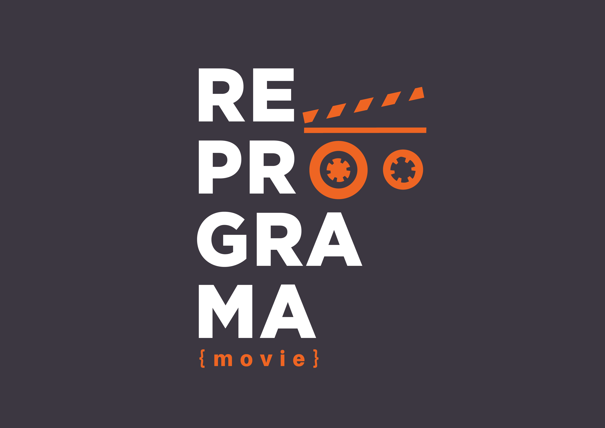

<div align = "center">
    
Turma Online Todas em Tech - Back-end | Semana 15: **Aplicanto testes com Jest e Supertest - CRUD com MongoDB**.


</div>


<br>
<div align = "center">

</div>
<br>

<div align = "center">

# Reprograma { movie }

</div>

<div align = "justify">

A web API **Reprograma { Movie }**, é uma aplicação onde é possível acessar informações detalhadas sobre os filmes da base de dados, possibilitando a busca de filmes através do ID, título ou gênero específico. Também é possível cadastrar novos filmes, atualizar um filme específico, alterar os filmes favoritados e deletar filmes utilizando o ID.

No projeto foi implementado testes automatizados utilizando o Jest e o Supertest em Node.js. Na aplicação foi ultilizado o banco de dados noSQL MongoDB.


<br>

## 📁ARQUITETURA DO PROJETO
<div align = "justify">


<br>

```
 📁 para_o_lar
   |
   |-  📁 assets
   |
   |-  📁 src
   |    |
        |- 📁 📄 app.js
   |    |- 📁 config
   |         |- 📄 database.js
   |
   |    |- 📁 controllers
   |         |- 📄 movieController.js
   |
   |    |- 📁 models
   |         |- 📄 movieSchema.js
   |
   |    |- 📁 routes
   |         |- 📄 movieRoutes.js 
   |
   |    |- 📁 test
   |         |- 📄 api.test.js     
   |
   |- 📄 .env
   |- 📄 .env.example
   |- 📄 .gitignore
   |- 📄 package-lock
   |- 📄 package
   |- 📄 README.md
   |- 📄 server.js

```
<br>

## DESENVOLVIMENTO 
<div align = "justify">

O primeiro passo para a realização do projeto foi a criação do banco de dados, no MongoDB Atlas, contendo as informações de `cadastro` de cada `filme`, onde consta um **id** numérico único, o título do filme, ano de lançamento, gênero, duração, diretor, atores e uma breve sinopse do filme.
  
<br>

<div align = "center"> Exemplo de filme cadastrado:
</div>

```json
{
            "_id": "62b6409b0726016f8b86c755",
            "Title": "Inception",
            "Year": "2010",
            "Genre": ["Ficção científica", "Suspense"],
            "Runtime": "2h28m",
            "Director": ["Christopher Nolan"],
            "Actors": ["Leonardo DiCaprio", "Marion Cotillard", "Elliot Page"],
            "Plot": "There are many variations of passages of Lorem Ipsum",
            "createdAt": "2022-06-24T22:54:19.285Z",
            "updatedAt": "2022-06-24T22:54:19.285Z"
}   
```
<br>
</div>

## ROTAS 
<div align = "justify">

####  Método GET: FILMES

<div align = "center">

|  Método  |                  Rota                       |                                Descrição                      |
| :------: | :-------------------------------------:     | :-------------------------------------------------------:     |
|  `GET`   | localhost:PORT/movies/all                   |                            Lista de todos os filmes cadastrados         |
|  `GET`   | localhost:PORT/movies/by_id/:id             |                          Busca um filme por ID             |
|  `GET`   | localhost:PORT/movies/by_title/?           |                                  Busca filmes pelo título   |
|  `GET`   | localhost:PORT/movies/by_director/?             |Busca filmes por Diretor|
|  `GET`   | localhost:PORT/movies/genre/?           |                                  Busca artistas por gênero   |

<br>
</div>

####  Método PUT: FILMES

<div align = "center">

|  Método  |                  Rota                       |                                Descrição                     |
| :------: | :-------------------------------------:     | :-------------------------------------------------------:    |
|   `PUT`  |  localhost:PORT/movies/update/:id       |Busca por ID e atualiza o cadastro. Os itens que não foram enviados para atualização são mantidos conforme o cadastro inicial |

<br>
</div>

####  Método DELETE: FILMES

<div align = "center">

|  Método  |                  Rota                       |                                Descrição                     |
| :------: | :-------------------------------------:     | :-------------------------------------------------------:    |
| `DELETE` |  localhost:PORT/movies/delete/:id     |Busca por ID e deleta o cadastro do filme                 |

<br>
</div>


<div align = "justify">


##  INFORMAÇÕES TÉCNICAS 
###  DEPENDÊNCIAS:

<div align = "justify">

Para que fosse possível a execução desse projeto, foi necessário a utilização de algumas dependências, descritas a seguir:
</div>

<br>

###  ⚙️ Módulos:

<div align = "justify">

- [Express](https://www.npmjs.com/package/express) - Framework para aplicativo da web do Node.js;
<br>

- [Nodemon](https://www.npmjs.com/package/nodemon) - Ajuda no desenvolvimento de sistemas com o Node. js reiniciando automaticamente o servidor;
<br>

- [Cors](https://www.npmjs.com/package/cors) - Permite que um site acesse recursos de outro site mesmo estando em domínios diferentes.
 <br>

 - [Mongoose](https://www.npmjs.com/package/mongoose) - É uma biblioteca de programação orientada a objetos JavaScript que cria uma conexão entre MongoDB e a estrutura de aplicativo da web Express.
 <br>

 - [Dotenv](https://www.npmjs.com/package/dotenv) - Carrega variáveis de ambiente de um arquivo .env para process.env.

 - [Jest](https://www.npmjs.com/package/jest) - Framework de teste unitário de código aberto em JavaScript criado pelo Facebook a partir do framework Jasmine.

 - [Supertest](https://www.npmjs.com/package/supertest) - É uma módulo que forja requisições visando testar webservers em Node.js e verifica o retorno das mesmas para automatizar testes desde tipo de infraestrutura, principalmente web APIs.
 
 <br>
</div>

### 📑 Arquivos: 

<div align = "justify">

- [package-lock.json](https://github.com/Geankre/ON15-TET-S15-TESTES/blob/Geankre/para_o_lar/package-lock.json) - Especifica a versão e suas dependências.
<br>

- [package.json](https://github.com/Geankre/ON15-TET-S15-TESTES/blob/Geankre/para_o_lar/package.json) - Arquivo de configuração utilizado para estipular e configurar dependências.
<br>

- [.gitignore](https://github.com/Geankre/ON15-TET-S15-TESTES/blob/Geankre/para_o_lar/.gitignore) - Arquivo que lista quais arquivos ou pastas o Git deve ignorar.
<br>

</div>

<br>

###  INSTALAÇÃO: 

1. Entre na pasta onde você deseja clonar o repositório. Abra o **git** nela e digite: 

    ```bash
    $ git clone https://github.com/Geankre/ON15-TET-S15-TESTES
     ```

2. Digite a linha abaixo para entrar na branch correta: 

   ```bash
    $ git checkout Geankre
     ```

3. Digite a linha abaixo para entrar na pasta correta: 

    ```bash
    $ cd para_o_lar/
    ```
    
4. Escreva a seguinte linha para instalar as dependências utilizadas nesse projeto: 

   ```bash
    $ npm install
    ```
5. Inicie o servidor, utilize a frase: 
   ```bash
    $ npm run dev
    ```   

6. Abra outro terminal para iniciar os testes com o jest e o supertest, utilize a frase: 

   ```bash
    $ npm run test
    ```  

<br>

<div align = "justify">

###  TESTE: 

- Importe a coleção para teste deste servidor clicando [aqui](https://www.getpostman.com/collections/a09fd559fcb2ed682cac)!

- Copie o link acima e, no [Postman](https://www.postman.com/downloads/), clique em *Import* -> *Link* (cole o link) -> *Continue* -> *Import*.

- Ou forke diretamente para o seu Postman através do link:<div align = "justify"> [](https://app.getpostman.com/run-collection/a09fd559fcb2ed682cac?action=collection%2Fimport) </div>
<br>

### 👋🏾 AUTORA: 

- [Geankre Souza](https://github.com/Geankre)
<br>

- [LinkedIn](https://www.linkedin.com/in/geankresouza/)
<br>
<br>
